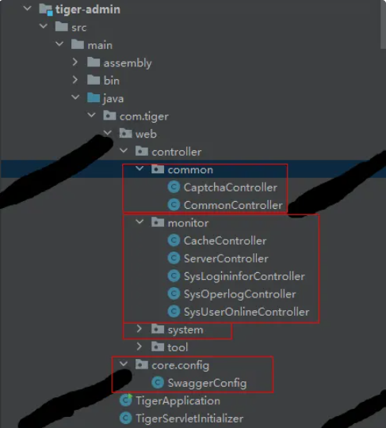

# 志愿者活动系统

#### 介绍
🔥🔥🔥本项目完全开源，采用的技术是SpringBoot+Vue+Mysql+MybatisPlus+Redis+Swagger，项目非常的nice，功能也在不断的迭代中，带详细的部署教程。可以用于学习或者二次开发，感谢提出宝贵的建议，技术交流微：fly996868

#### 软件架构
SpringBoot
Vue
MybatisPlus
SpringSecurity+JWT
Redis
MySQL
Swagger

#### 志愿者活动的功能

本系统是志愿者系统，用来志愿者管理、报名、活动组织等相关活动。

系统分为前台和管理员，前台使用者是用户，后台是管理员。

#### 系统演示

系统的界面设计美观大方，功能还可以进行二次开发。

#### 技术点讲解

tiger-admin(web服务入口)

这个相当于Controller层，也就是控制层， 对请求和响应进行控制，调用 Service 层进行业务逻辑处理，最后将处理好的数据返回给前端。

 **1. common
** 
CaptchaController   生成验证码

CommonController  文件上传下载

 **2. monitor(系统监控 + 日志管理)  
** 
CacheController    缓存监控

ServerController   服务监控

SysLogininforController  登录日志

SysOperlogController  操作日志

SysUserOnlineController  在线用户

 **3. system(系统管理)
** 
SysActivityController    活动信息管理

SysActivitySignNoticeController  签到通知公告

SysCommentController   活动评论

SysConfigController        参数配置

SysDeptController           部门信息

SysDictDataController     数据字典信息

SysDictTypeController     数据字典类型信息

SysEchartsController        图表信息

SysIndexController           后台首页

SysLoginController          登录验证

SysMenuController          菜单信息

SysMessageController     留言板信息

SysNoticeController         通知公告

SysPostController             岗位信息

SysProfileController         个人信息

SysRegisterController      注册验证

SysRoleController            角色信息

SysSignRecordController   签到记录

SysUserController               用户信息

SysVolunteerActivityRelationController 志愿者活动关系

SysVolunteerController   志愿者信息

SysVolunteerOrganizationController  志愿组织信息

SysVolunteerOrganizationRelationController   志愿者志愿组织关系

#### 参与贡献

1.  小孟
2.  珍惜

#### 特技

1, 开源不易，整理项目不易，star、fork支持下，可以给我们提出宝贵意见，非常感谢。

2，更多优质项目，我会持续更新，专业开发20年，嘿嘿……

3， 感谢：www.javaclimb.com
